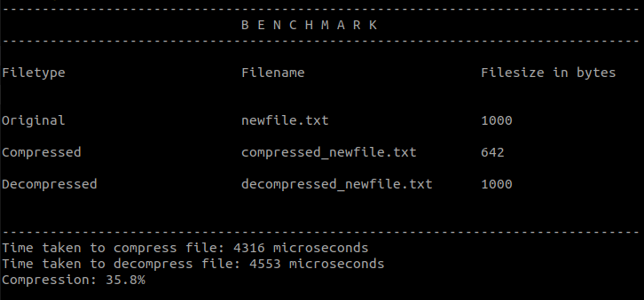

# HCL (Huffman Compression Library)

> HCL a custom C++ library that allows file compression using Huffman Compression algorithm.

[](https://repl.it/@bhumijgupta/huffman-demo)  [](https://www.codacy.com/manual/bhumijgupta/huffman-compression-library?utm_source=github.com&utm_medium=referral&utm_content=bhumijgupta/huffman-compression-library&utm_campaign=Badge_Grade)   

## Table of Contents

- [Features](#Features)
- [Benchmarks](#Benchmarks)
- [Usage](#Usage)
  - [Try Online](#Try-Online)
  - [Try Locally](#Try-Locally)
- [Methods](#Methods)
  - [compressFile](#compressFile)
  - [decompressFile](#decompressFile)
  - [benchmark](#benchmark)
- [Performance Comparison](#Performance-Comparison)
  - [Conclusion](#Conclusion)
- [Examples](#Examples)
- [Run tests](#Run-tests)
- [License](#License)
- [Author](#Author)

## Features

- Fast and efficient
- Supports all kinds of files (images, pdf, video, text, etc)
- High level abstraction methods to be used
- No need of understanding how compression algorithm works
- Light weight library
- Compression ratio of upto 50%

## Benchmarks

Below is the output for `huffmantool.benchmark()` method


## Usage

There are 2 ways to try the HCL library

### 1. Try Online

Try the HCL library online on my custom repl. [](https://repl.it/@bhumijgupta/huffman-demo)

### 2. Try Locally

1.  Clone this repo to your project folder  
    `git clone https://github.com/bhumijgupta/huffman-compression-library.git hcl`

2.  Import Huffman tool header and create new `huffmantool` object

```C++
// Filename main.cpp
#include "hcl/huffmantool.h"

int main(){
    huffmantool ht;
    .
    .
    .
}
```

3.  Compile and run file

```bash
g++ main.cpp && ./a.out
```

## Methods

### compressFile

```C++
compressFile(string sourceFile, string compressedFile = "") : string
```

Returns the destination of compressed file.  
If the `sourceFile` provided is invalid or cannot be opened, it returns an empty string.

If no `compressedFile` is provided, `compressedFile` is present at the same dir as `sourcefile` with prefix `compressed_`

### decompressFile

```C++
decompressFile(string compressedFile, string retrievedFile = "") : string
```

Returns the destination of decompressed file.  
If the `compressedFile` provided is invalid or cannot be opened, it reurns an empty string.

If no `retrievedFile` is provided, `retrievedFile` is present at the same dir as `compressedFile` with prefix `decompressed_` and removed `compressed_` prefix (if present)

### benchmark

```C++
benchmark(string sourcefile) : void
```

This method performs compression and decompression on the sourcefile provided and prints the following stats to the stdout.

```
--------------------------------------------------------------------------------
                              B E N C H M A R K
--------------------------------------------------------------------------------

Filetype                      Filename                      Filesize in bytes

Original
Compressed
Decompressed

--------------------------------------------------------------------------------
Time taken to compress file: XYZ microseconds
Time taken to decompress file: XYZ microseconds
Compression: XY.Z%

```

<b>Note</b>: For detailed understanding of code refer to [Wiki](https://github.com/bhumijgupta/huffman-compression-library/wiki).

## Performance Comparison

The `newfile.txt` is populated using lorem ipsum data from [lipsum.com](https://www.lipsum.com/) and the following data is noticed after executing `main.cpp`.

| Number of characters | Original file size (in bytes) | Compressed file size (in bytes) |
| :------------------: | :---------------------------: | :-----------------------------: |
|          10          |              10               |               36                |
|         100          |              100              |               116               |
|         1000         |             1000              |               642               |
|        10000         |             10000             |              5445               |
|        100000        |            100000             |              53354              |

### Conclusion

The compression ratio and performance of the Huffman coding depends on the size of input text and the frequency of distinct characters in the file. From the above comparison we can see that the current implementation of huffman coding does not produce positive compression ratio for small files due to the overhead of storing `Huffman Tree` in the compressed file, which is useful at the time of decompression.

But we notice, as the size of file increases (>=1000 bytes), the compression ratio stays at almost 50%.

## Examples

Following are the list of examples

- [CLI tool for file compression](examples/cli_compression.cpp)
- [Benchmarking tool](examples/benchmark.cpp)

## Run tests


The tests are stored in `tests/` directory. You need to install [googletest](https://www.eriksmistad.no/getting-started-with-google-test-on-ubuntu/) framework to run test.

```bash
cd tests/
cmake CMakeLists.txt
make
./runTests
```

## License


This library is licensed under MIT License. The license file can be found [here](LICENSE)

## Author

[](https://forthebadge.com)

### Bhumij Gupta

 [](https://www.linkedin.com/in/bhumijgupta/) 

---

```C++
if(repo.isAwesome || repo.isHelpful){
    StarRepo();
}
```
